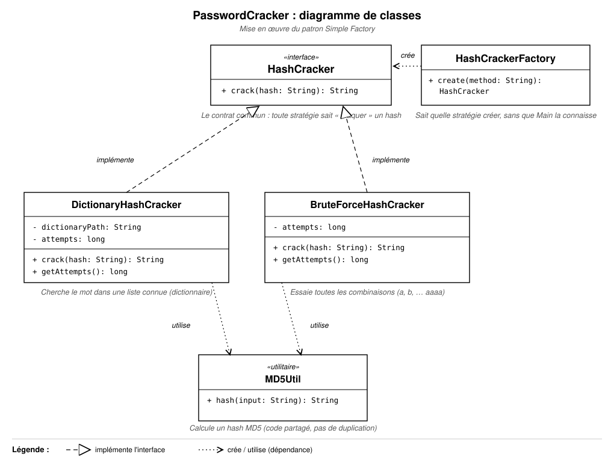

# PasswordCracker v1

Outil en ligne de commande permettant de retrouver un mot de passe à partir de son hash MD5, par attaque
par dictionnaire ou par force brute. Développé dans le cadre du Mini-Projet 1 (mise en œuvre du patron
**Simple Factory**).

## 1. Introduction

Ce projet est la première version d'un outil pédagogique de cassage de mots de passe, `passwordCracker`.
Il illustre la conception d'une architecture orientée objet modulaire reposant sur le polymorphisme et le
patron de création **Simple Factory**.

## 2. Présentation du problème

En cybersécurité, les mots de passe sont stockés sous forme de hash (empreinte) plutôt qu'en clair. Un
audit de sécurité peut nécessiter de vérifier la robustesse d'un mot de passe en tentant de retrouver sa
valeur en clair à partir de son hash MD5. Deux stratégies classiques existent :

- **Attaque par dictionnaire** : on teste une liste de mots connus.
- **Attaque par force brute** : on génère et teste toutes les combinaisons possibles d'un alphabet donné.

## 3. Architecture

Le programme définit une interface commune `HashCracker`, implémentée par deux stratégies concrètes
(`DictionaryHashCracker` et `BruteForceHashCracker`). Une fabrique unique (`HashCrackerFactory`) est
responsable de l'instanciation de la bonne stratégie selon la méthode demandée, de sorte que le programme
principal ne dépende jamais directement des classes concrètes.

| Classe | Responsabilité |
|---|---|
| `HashCracker` | Interface commune : contrat `crack(hash): String`. |
| `DictionaryHashCracker` | Charge un fichier dictionnaire et compare le hash MD5 de chaque mot au hash recherché. |
| `BruteForceHashCracker` | Génère toutes les combinaisons de l'alphabet `a-z` jusqu'à 4 caractères et compare leur hash MD5. |
| `MD5Util` | Utilitaire partagé de calcul de hash MD5 (évite la duplication de code entre les deux stratégies). |
| `HashCrackerFactory` | Fabrique simple : centralise la création des stratégies à partir d'une chaîne (`BRUTE` / `DICO`). |
| `Main` | Point d'entrée console : parse les arguments, délègue à la fabrique, affiche le résultat. |

## 4. Diagramme UML



## 5. Usage du patron Simple Factory

Le programme principal ne crée jamais directement une instance de `DictionaryHashCracker` ou de
`BruteForceHashCracker`. Il passe systématiquement par `HashCrackerFactory.create(method)`, qui retourne
un objet typé `HashCracker` :

```java
HashCracker cracker = HashCrackerFactory.create("DICO");
String password = cracker.crack(hash);
```

Cela centralise la logique de création, découple le code appelant des classes concrètes, et permet
d'utiliser le polymorphisme : le programme principal manipule uniquement l'interface `HashCracker`.

## 6. Résultats obtenus

Compilation et exécution :

```bash
javac -d bin src/passwordcracker/*.java

java -cp bin passwordcracker.Main -m DICO -h 5f4dcc3b5aa765d61d8327deb882cf99
# Password found: password
# Temps d'execution : 40 ms
# Tentatives : 4

java -cp bin passwordcracker.Main -m BRUTE -h 098f6bcd4621d373cade4e832627b4f6
# Password found: test
# Temps d'execution : 1022 ms
# Tentatives : 355414

java -cp bin passwordcracker.Main -m DICO -h 00000000000000000000000000000000
# Password not found
```

*Vidéo de démonstration : [lien à ajouter]*

## 7. Difficultés rencontrées

Au début j'avais dupliqué le calcul du MD5 dans les deux stratégies, donc j'ai sorti ça dans une classe
utilitaire `MD5Util` pour éviter la répétition.

Autre point : la fabrique doit connaître à l'avance toutes les stratégies disponibles. Du coup si on veut
ajouter une nouvelle méthode de cassage plus tard, il faudra modifier `HashCrackerFactory` (voir la
conclusion ci-dessous).

## 8. Conclusion

Le patron Simple Factory a permis de centraliser la création des objets et de garder le programme
principal indépendant des classes concrètes. Par contre il a une vraie limite : pour ajouter une nouvelle
stratégie il faut modifier la fabrique, ce qui viole le principe Open/Closed. On verra comment corriger ça
avec un patron de création plus flexible dans le prochain mini-projet.

Les réponses détaillées aux questions de réflexion du sujet sont disponibles dans
[`docs/questions-reflexion.md`](docs/questions-reflexion.md).

## Structure du projet

```
PasswordCracker/
├── src/passwordcracker/         # Code source Java
├── resources/                   # Dictionnaire de mots
├── docs/
│   ├── uml-diagram.svg          # Diagramme de classes
│   └── questions-reflexion.md   # Réponses aux questions de réflexion
├── bin/                          # Classes compilées (généré, ignoré par git)
└── README.md
```
